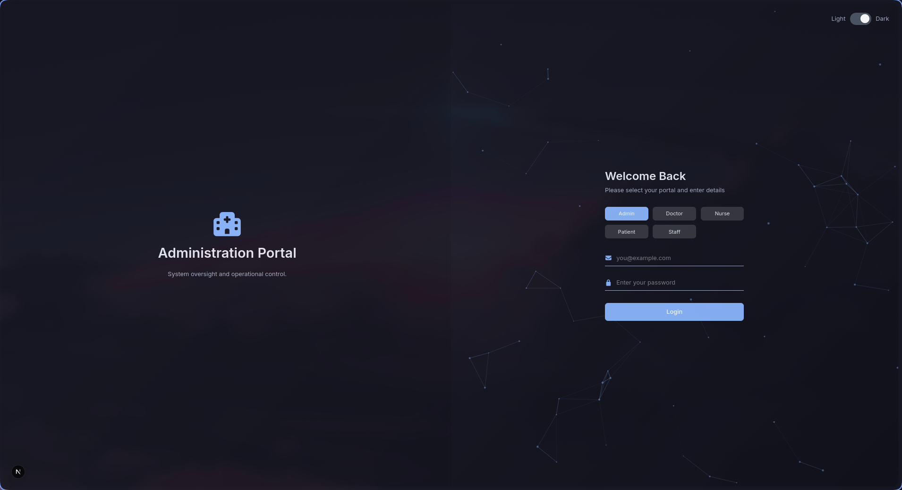
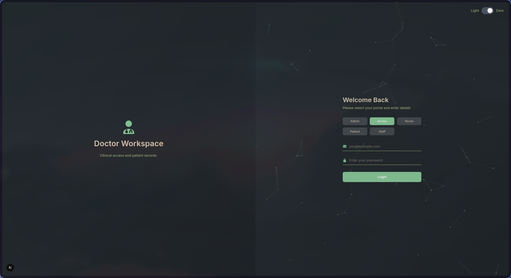
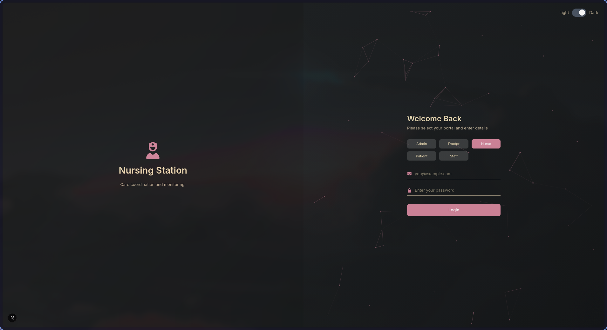
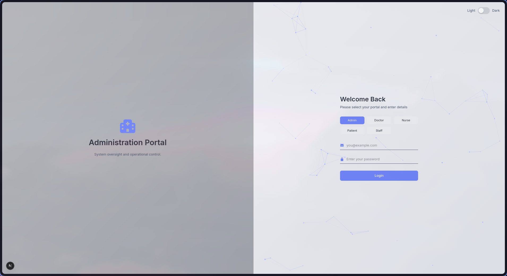
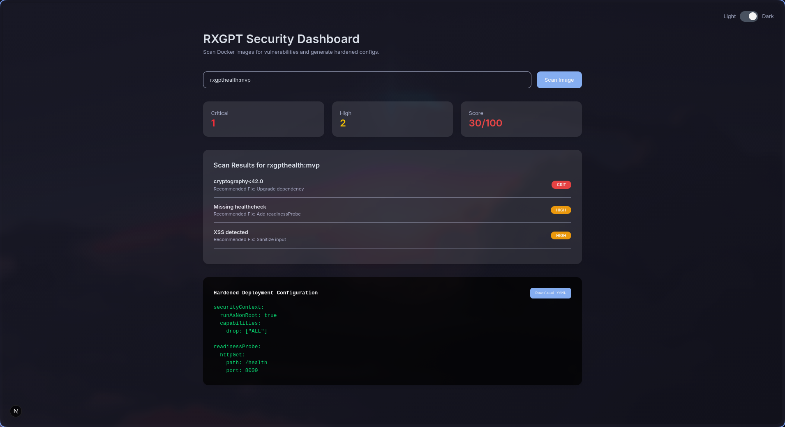

## Task 1 – Python CLI Scanner

### Run

```bash
python rxgpt-scan.py rxgpthealth:mvp
```
### Screenshot – Vulnerability Scan


### Task 2 - React Dashboard
### Run

```bash
cd frontend
npm run dev
```
### Screenshot – Login Screen






### Screenshot – Dashboard



### Task 3 - K8s Deployment

```bahsh
kubectl apply -f k8s-job.yaml
kubectl get jobs
kubectl logs job/rxgpt-security-scan
```